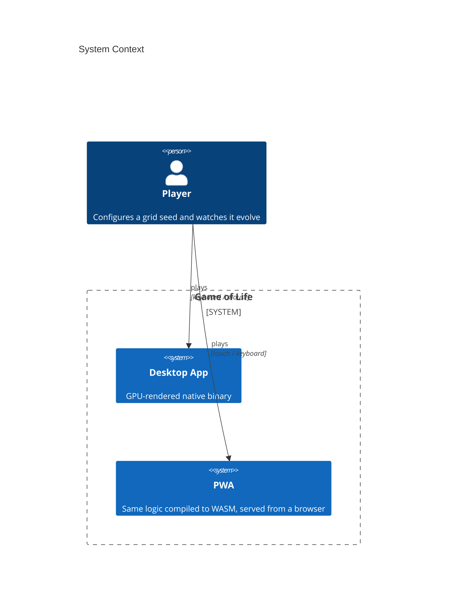
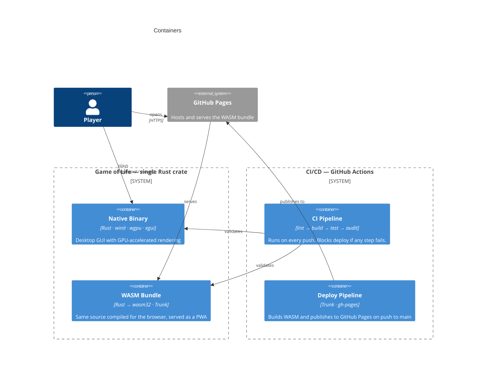
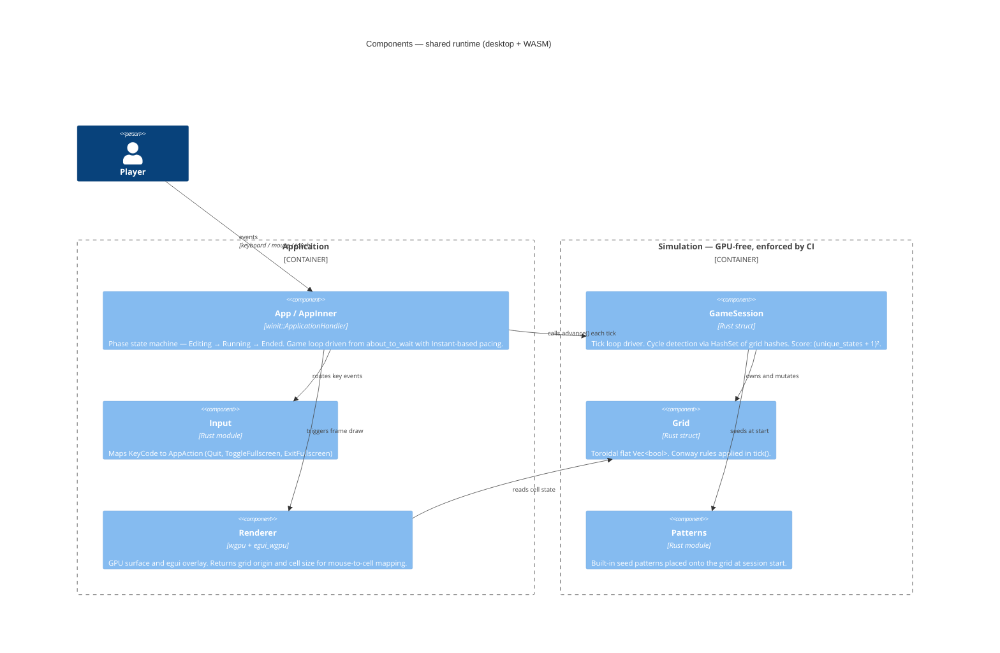

# Game of Life

[](https://github.com/rvuong/game_of_life_gui/actions/workflows/ci.yml)
[](https://rvuong.github.io/game_of_life_gui/)

Conway's Game of Life — rendered with `wgpu` and `egui` in Rust, compiled to WASM and deployed as a PWA.

**[Try it in your browser →](https://rvuong.github.io/game_of_life_gui/)**

---

## Why this project exists

This is a deliberate learning experiment, not a production application. I used it to push into three areas simultaneously:

**1. Native GUI in Rust.**
Most of my systems work doesn't involve rendering. I wanted to understand the `winit` event loop, the `wgpu` pipeline, and how immediate-mode UI (`egui`) fits into a GPU-driven frame loop — without copying a tutorial.

**2. Cross-platform WASM with a mobile-first constraint.**
The same Rust source compiles to `wasm32-unknown-unknown` and is served as a PWA via `Trunk`. The constraint of targeting mobile forced real decisions: layout that works without a mouse, touch-friendly interaction, and CI that builds and deploys the WASM bundle automatically on every push to `main`.

**3. Claude Code-assisted development.**
I used this project as a testbed for working with an AI coding assistant on something non-trivial — from architecture decisions through to iteration and debugging. The goal was to understand where AI assistance adds leverage and where it needs direction.

The constraint I imposed on myself: *experimental* doesn't mean *sloppy*. The CI pipeline runs on every push, tests are required to pass before a deploy, and the simulation layer is architecturally isolated from the rendering layer — enforced by the pipeline itself, not just convention.

---

## Key decisions worth explaining

**Simulation layer is GPU-free by design.**
`src/sim/` has zero knowledge of `winit`, `wgpu`, or `egui`. The CI pipeline greps for those imports and fails the build if they appear. This means the entire game logic is unit-testable without a window or GPU context, which matters a lot when running headless in CI.

**`screen_to_cell()` is a free function, not a method.**
Mouse click → cell coordinate mapping lives outside `App` so it can be unit-tested in isolation. A small decision, but it prevented a class of integration-only bugs.

**Cycle detection via content hashing.**
The session detects when the grid has returned to a previously seen state using a `HashSet<u64>` of grid hashes, then terminates. Score formula: `(unique_states_seen + 1)²` — rewarding grids that sustain variety before collapsing.

**Borrow conflict workaround in the egui closure.**
`egui`'s immediate-mode closures and Rust's borrow checker conflict when you try to mutate owned state inside a closure that also borrows it. The pattern I landed on: collect mutations into local variables inside the closure, apply them after it returns.

---

## Architecture

### C1 — System Context



### C2 — Containers



### C3 — Components



### File structure

```
src/
├── lib.rs              # re-exports sim:: only — no GPU/window deps
├── main.rs             # binary entry point (desktop)
├── app.rs              # App / AppInner — winit::ApplicationHandler, phase state machine
│                       # AppPhase: Editing | Running | Ended(EndState)
├── input.rs            # KeyCode → AppAction (Quit, ToggleFullscreen, ExitFullscreen)
├── sim/
│   ├── mod.rs          # Grid — toroidal flat Vec<bool>, Conway tick()
│   ├── session.rs      # GameSession — loop driver, cycle detection, scoring
│   └── patterns.rs     # built-in seed patterns
└── render/
    └── mod.rs          # Renderer (wgpu surface + egui_wgpu), draw_grid()
                        # returns (grid_origin, cell_size) for mouse → cell mapping
```

**CI pipeline:** Lint → Build → Test → Audit (each step depends on the previous).
The Lint job includes the sim purity check. The Audit job runs both `cargo audit` and `cargo deny` for dependency security and license policy.

**Deploy pipeline:** on push to `main`, `Trunk` compiles the WASM build and `peaceiris/actions-gh-pages` publishes it to GitHub Pages.

---

## Build & Run

```sh
# Prerequisites: Rust stable toolchain (rustup)

cargo build                                   # compile
cargo run                                     # launch the desktop GUI
cargo test                                    # unit + integration tests
cargo clippy --all-targets -- -D warnings     # lint (zero warnings enforced)
cargo fmt                                     # format
cargo audit                                   # dependency vulnerability scan
cargo deny check                              # license / source policy
```

---

## Keyboard shortcuts

| Key          | Action            |
|--------------|-------------------|
| `Q`          | Quit              |
| `F11`        | Toggle fullscreen |
| `Esc`        | Exit fullscreen   |
| Close button | Quit              |

---

## Known limitations

- **No persistence** — grid state is lost on close; no save/load.
- **No runtime grid resize** — dimensions are fixed at startup.
- **Desktop native build requires a GPU + display** — not runnable headless.
- **PWA/WASM is a proof of concept** — compiles and runs, but not feature-complete relative to the desktop version.

---

## Built with Claude Code

This project is as much an experiment in AI-assisted development workflow as it is in Rust GUI programming.

[Claude Code](https://claude.ai/code) was used at two distinct levels, deliberately kept separate:

**Architecture and design** — I used a capable model (Claude Opus) as a sounding board for structural decisions: layer boundaries, the sim purity constraint, the borrow conflict pattern, cycle detection strategy. The rule I set for myself: I drive every decision. The model proposes, challenges, and surfaces trade-offs; I choose. Nothing gets committed that I haven't understood and deliberately accepted.

**Implementation** — once a decision was made, coding was delegated to a lighter developer agent. Its job is mechanical: translate a spec into working Rust, follow established patterns, stay within the agreed boundaries. Speed matters here, judgment does not.

The split matters. Using AI as a replacement for architectural thinking produces code that works but can't be reasoned about or maintained. Using it only for boilerplate wastes its strongest capability. The workflow I was testing: keep the human in the driver's seat on everything that requires judgment, and compress the time cost of everything that doesn't.
